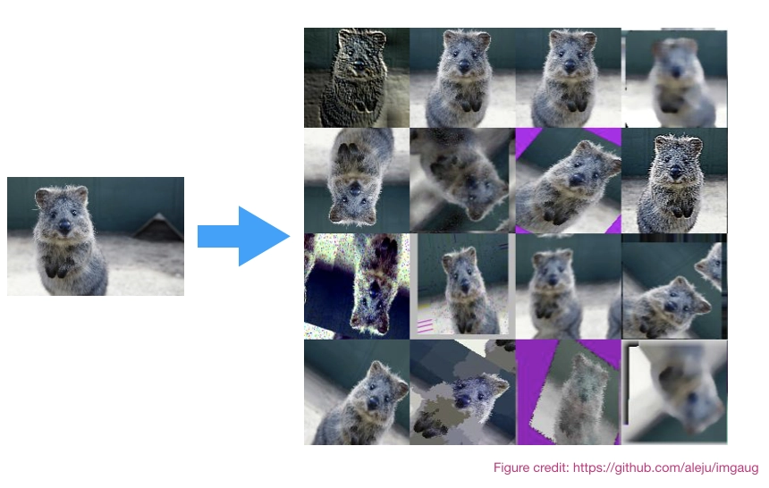
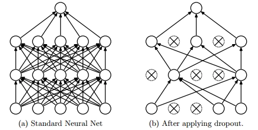
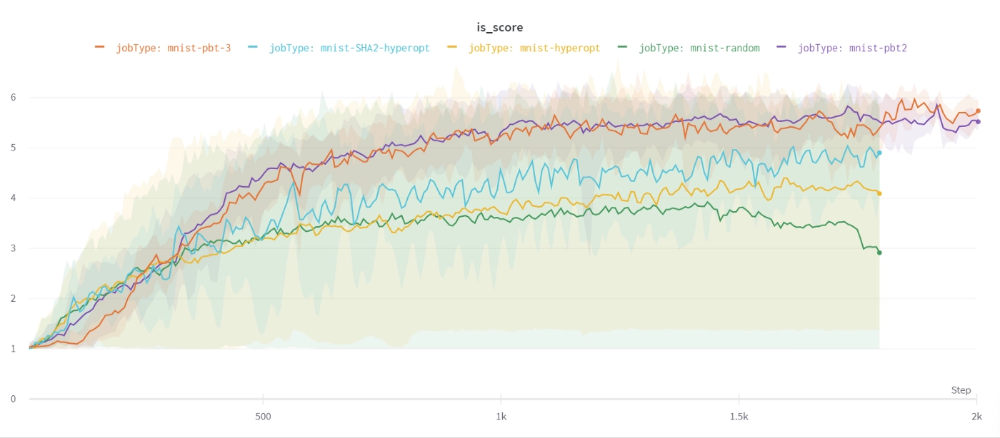
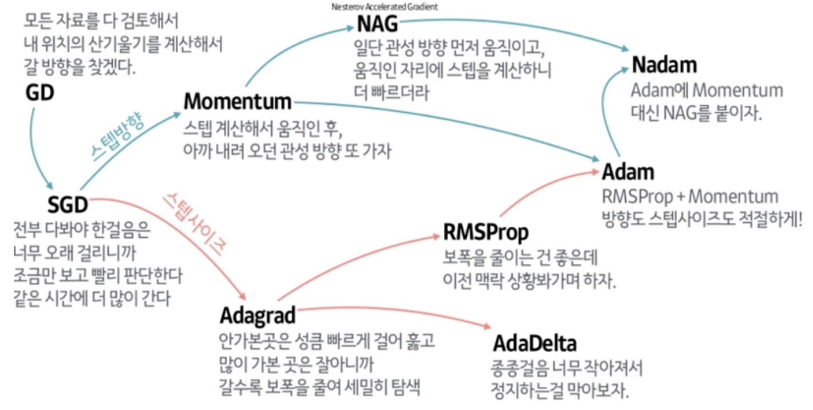

# 딥러닝 모델 성능 개선 방법

### Dacon 의 여러가지 대회들을 그동안 구경하며 참여해보고 싶다는 생각이 들게 되었다. 그래서 미리 모델 성능 향상을 위한 방법들을 공부해보려고 한다. 이 문서는 딥러닝 모델의 성능을 끌어올릴 수 있는 방법을 담은 로드맵들을 정리해보았다.

# Variance / Bias Analysis

### 무턱대고 이 방법 저 방법을 시도하며 박치기를 하는 방식은 바람직하지 못하다. 평가 metric 을 보고 어떤 부분에서 개선을 해야할지 분석해야 한다.
### 평가 메트릭에는 여러가지가 있는데 어떤 평가 메트릭을 사용해야 하는지를 결정해야한다. 문제 상황에 맞는 적절한 평가 메트릭을 사용하여, 모델의 성능을 정확히 이해해야 한다.
### 평가 메트릭을 분석하는 방법 또한 여러가지가 있는데, Training Error 와 Validation Error 를 공부했다.
### 우선 Bias 와 Variance 를 알아야한다. 이 둘은 모델의 상태를 나타내는 척도 중 하나이다. Variance 는 높을수록 예측 값들이 흩어져있고, Bias 가 높을수록 예측 값들이 정답과 떨어져있다는 것을 의미한다.
### 이런 Variance 와 Bias 를 보는 방법이 Training Error 와 Validation Error 를 이용하는 것이다.

 
### 위 그래프의 왼쪽을 보면 Training Error 가 높다.. 이는 모델의 예측 값이 정답 값과 동떨어져 있다는 것을 의미한다. 즉, **모델의 Bias 가 높다는 뜻** 이다.
### 그래프의 오른쪽에는 Training Error 와 Validation Error 의 차이가 크게 나는 것을 확인할 수 있다. 이는 예측값들이 흩어져 있어 모델의 Variance 가 높다는 것을 의미한다.

### 이를 통해 알아낸 것을 바탕으로 모델의 성능을 어떻게 향상 시킬 수 있을까?

# Variance 가 높다면?
* More Data (1)
* Regularization (2)
* Model selection (3)
* Hyperparameter Tuning (4)

# Bias 가 높다면?
* Bigger Model
* Longer/Better Optimization (5)
* Model selection (3)
* Hyperparameter Tuning (4)

## 이제 각각의 방법에 대해 알아보자.

# (1) More Data

### 이 방법은 데이터의 양을 늘려 모델의 과적합을 피하는 방법이다.
### 일반적인 방법으로 더 많은 학습 데이터를 수집하는것은 현실적으로 어려움이 있기 때문에 주로 대회에서는 Data Augmentation 이라는 방법을 사용한다.

### 주로 이미지를 뒤집거나 잘라서 학습 데이터의 양을 늘려주는 방법을 사용한다. Pytorch 에서 Data Augmentation 을 위한 모듈을 제공하고 있어서, 편리하게 자신의 코드에 추가할 수 있다.

# (2) Regularization

### 앞서 모델의 Variance 가 높다는 것은 모델의 과적합을 의미한다고 했었다.

### 이를 방지하기 위해서 Weight 가 높은 값을 가지는 것을 방지할 필요가 있는데, 이를 위해 사용되는 방법이 바로 *정규화* 이다. 자세한 설명은 아래 블로그에 나와있다.
### *참고하면 좋은 글*

* <https://jeongwooyeol0106.tistory.com/26>
* <https://subinium.github.io/introduction-to-normalization/>

### 이외에도 정규화 기법의 일종으로 Drop out 기법이 있다.
### Drop out 기법은 임의로 특정 노드를 학습에 제외시켜 모델의 과적합을 방지한다.

### *참고하면 좋은 글*
* <https://heytech.tistory.com/127>
* <https://wandb.ai/wandb_fc/korean/reports/—VmlldzoxNDI4NzEy>

# (3) Model selection

### 내가 사용하는 목적에 맞춰 모델을 정확히 고르는것도 모델의 성능을 개선하는 방법 중 하나이다.
### 그런 모델을 선정하려면 모델을 찾아봐야 하는데 어떻게 찾을 수 있을까?
### 가장 좋은 방법은 최신 발표된 논문들을 읽고, 최신 연구 트렌드를 익히는 것이다.
### 해결하고자 하는 Task 의 벤치마크 리더보드를 확인하는것이 좋다.
## "paperwithcode" 에서 강력한 성능의 최신 트렌드 논문과 모델을 간편하게 확인할 수 있다.
### 참고하면 좋은 글
* <https://velog.io/@woojinn8/LightWeight-Deep-Learning-0.-딥러닝-모델-경량화>
* <https://blog.pingpong.us/ml-model-optimize/>

# (4) Hyperparameter Tuning

### hyperparameter 란 모델의 파라미터(weight, bias) 를 결정하기 위한 파라미터들을 의미한다.
### 대표적인 예로 learning rate, #iterations, #hidden layers, #hidden units, activation function, mini batch size 등이 있다. 모델의 성능을 결정짓는 중요한 요소 중 하나이다.
### 아래 그림에서 같은 모델이더라도 하이퍼 파라미터를 어떻게 설정하느냐에 따라 성능이 다른것을 볼 수 있다.

### 그렇다면 하이퍼 파라미터를 어떻게 잘 설정할 수 있을까?
### 사실 정해진 방법은 없고, 경험적으로 하나하나 설정해보면서 좋은 세팅을 찾는 방법 뿐이다.
### 이 과정을 직접 행하느냐, 혹은 프로그램으로 수행하느냐에 따라 튜닝 방법이 나뉘게 된다.
### 아래 블로그를 참고하면 좋다.

* <https://velog.io/@emseoyk/하이퍼파라미터-튜닝#-manual-search>

# (5) Longer/Better Optimization

### 딥러닝은 결국 loss 를 최소화 하도록 모델을 최적하 하는 문제이다. 이때 optimizer 는 매우 중요한 역할을 합니다.
### 어떤 optimizer 방식을 사용하냐에 따라 모델의 학습이 매우 더디게 진행되거나 local ooptimization 에 빠질 수도 있다.

### 아래 두 그림은 다양한 Optimizer 종류를 나타내었다.

### 참고하면 좋은 글
* <https://simsim231.tistory.com/95>
* <https://www.analyticsvidhya.com/blog/2021/10/a-comprehensive-guide-on-deep-learning-optimizers/>
* <https://medium.com/mlearning-ai/optimizers-in-deep-learning-7bf81fed78a0>

## Learning Rate Scheduler

### 적절한 Learning Rate 를 고정된 값으로 사용할 수도 있지만, 학습이 진행됨에 따라 동적으로 바꿔가며 사용할 수도 있다. 해당 기법을 Learning Rate Scheduler 라고 한다. 이를 통해 모델이 보다 수월하게 최적화를 진행할 수 있다.
### 스케줄러에는 MultiplicativeLR, StepLR 등 다양한 방식이 존재한다.
### 참고로 모델의 학습이 더디거나, 과적합이 발생할 때 학습을 조기 종료하는 Early Stopping 기법도 있다.

## Conclusion

### 이외에도 앙상블, Cross Validation 등 성능을 향상시키기 위한 다양한 방법들이 있다.
### 또한 ML 에서는 garbage in, garbage out 이라는 말이 있듯, 데이터셋의 중요함도 모델의 성능에 큰 영향을 미친다.
### EDA 와 전처리 과정도 모델의 성능 향상에 큰 영향을 미친다.

## Reference

* <https://facerain.club/improve-dl-performance/>

# 참고
### 해당 포스트는 위 Reference 에 기재된 글을 다시한번 작성하며 공부한 내용입니다. 문제가 있을 시, sabin20030720@gmail.com 으로 메일을 보내주시면 포스트를 삭제하도록 하겠습니다.
