# torchvision.transforms 함수들 정리

### 회사에서 모델을 여러가지로 학습해서 데이터를 분석한 결과를 바탕으로 Dataset 을 건드려야 할 때가 왔다. 전처리 전 torchvision.transforms의 함수들을 정리하고 넘어가려한다.

## CenterCrop
### CenterCrop은 이미지의 중앙을 crop 하는 함수이다. parameter 로 output 의 size 를 요구한다.
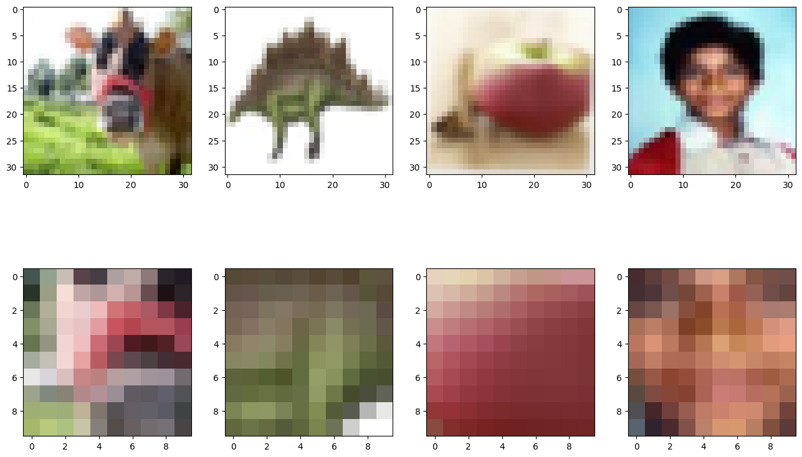

## RandomCrop
### RandmCrop은 랜덤한 위치의 구역을 crop 하는 함수이다. parameter 로 output 의 size 를 요구한다.
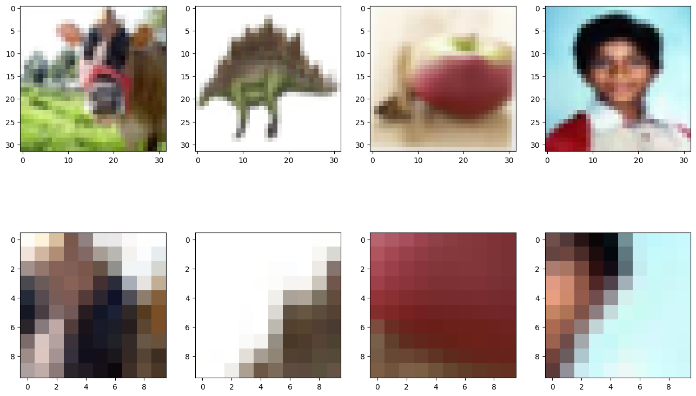

## Resize
### Resize는 말 그대로 이미지의 사이즈를 변경하는 함수이다. parameter 로 size 를 요구한다.
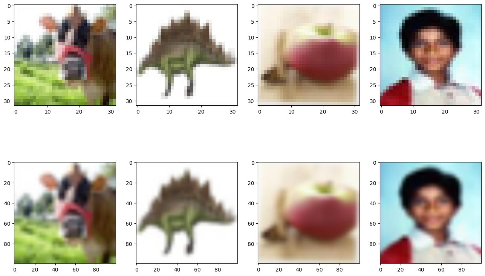

## RandomResizedCrop
### RandomResizedCrop은 랜덤한 위치에서 crop 한 후 이미지를 resize 하는 함수이다. parmeter 로 size 를 요구한다.
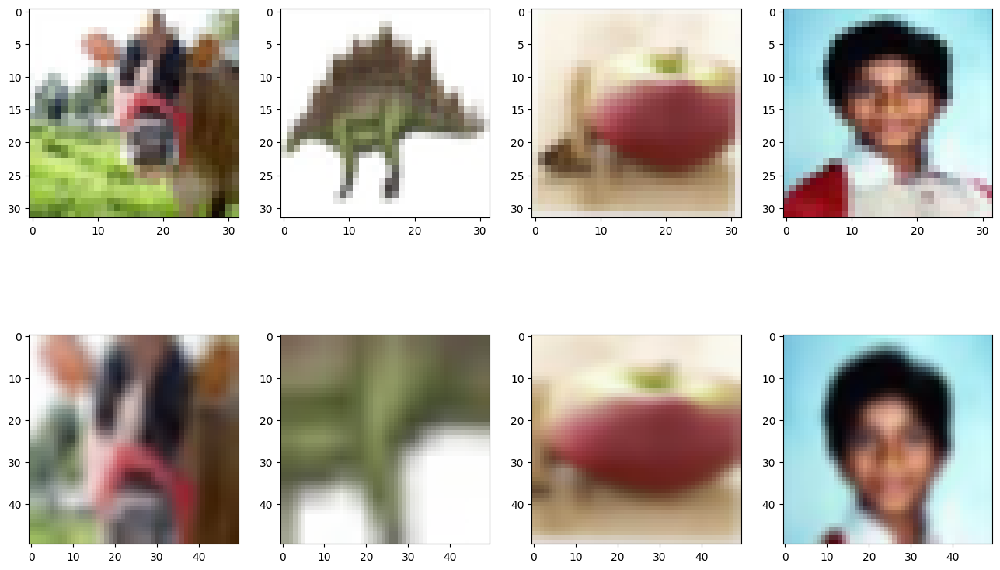

## RandomAffine
### RandomAffine은 이미지의 center 를 유지하면서 affine transform 을 하는 함수이다.
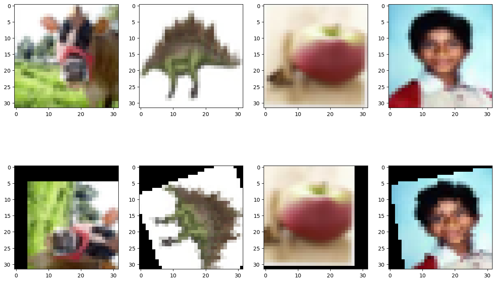

## RandomRotation
### RandomRotation은 이미지를 랜덤하게 rotation 해주는 함수이다. parameter 로 degree 를 요구한다. degree 는 단일 float 또는 sequence 로 받을 수 있다.
### sequence 로 입력받을 경우 (min, max) 범위 내에서 랜덤하게 degree 가 결정된다. 단일 float 으로 입력받을 경우 (-input, +input) 범위 내에서 랜덤하게 degree 가 결정된다.
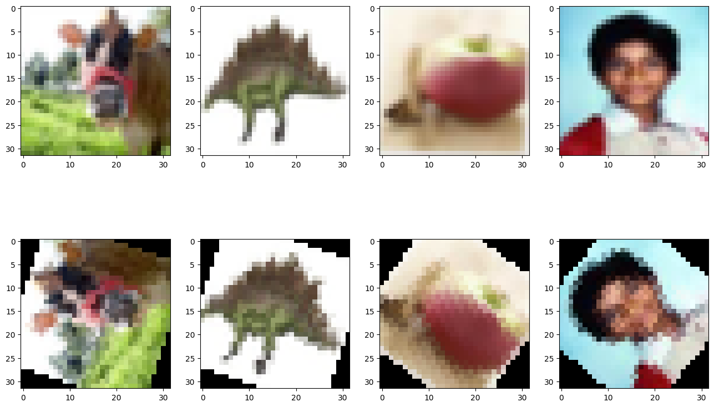

## RandomVerticalFlip
### RandomVerticalFlip은 이미지를 샘플링 후, 수직으로 flip 하는 함수이다. 입력 파라미터로는 sampling, ratio, p 를 요구한다.
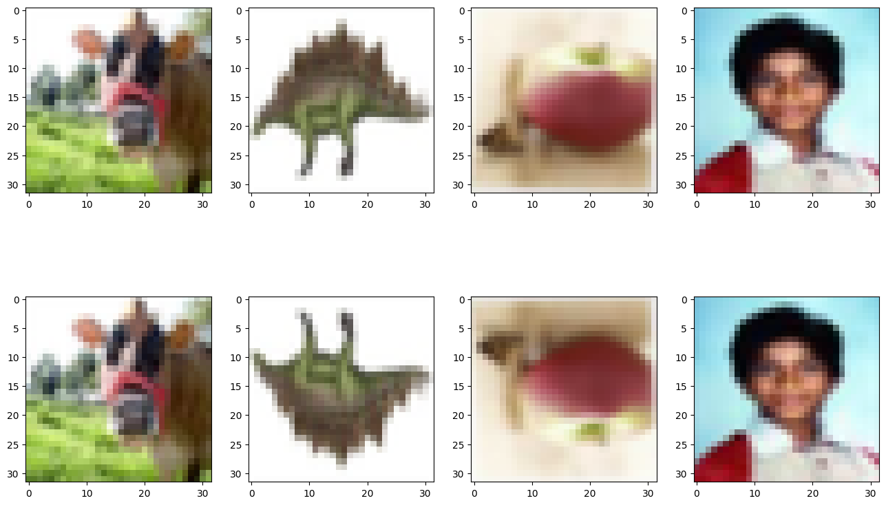

## RandomHorizontalFlip
### RandomHOrizontalFlip은 이미지를 샘플링 후, 수평으로 flip 하는 함수이다. 입력 파라미터로는 sampling, ratio, p 를 요구한다.
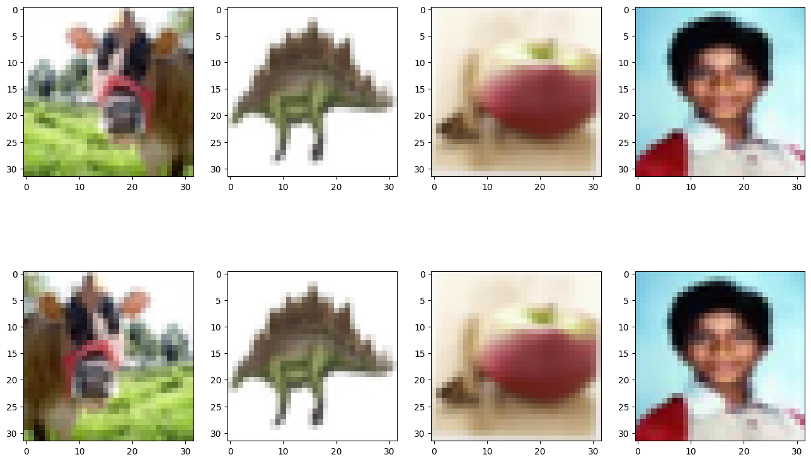

## ColorJitter
### ColorJitter는 이미지의 밝기, 채도, 명도 등등 컬러 관련 여러 속성들을 임의로 변경하는 함수이다. lightness, saturation, hue 등을 parameter 로 요구한다.
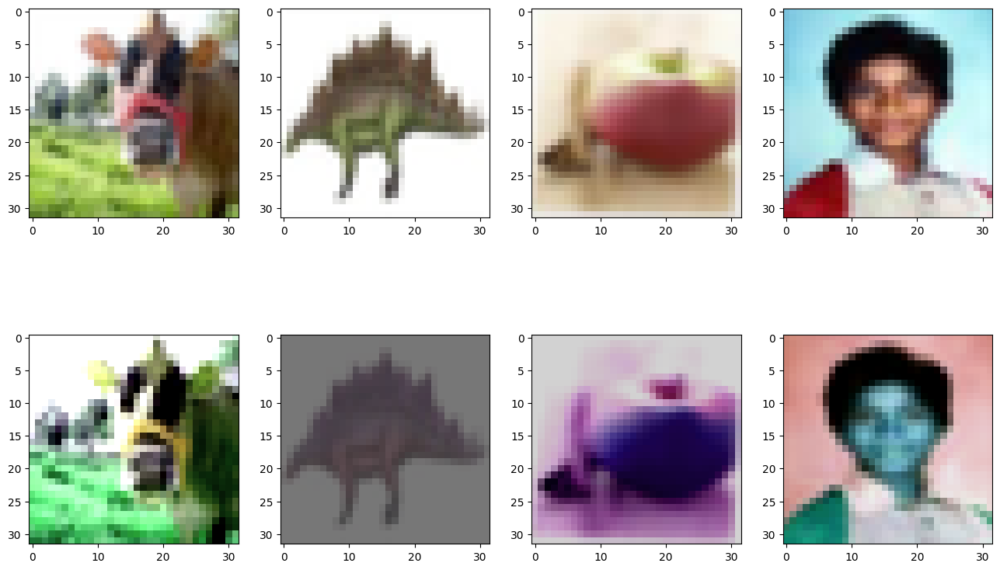

## Normalize
### Normalize는 Torch tensor 형태의 데이터에만 적용이 가능한 함수이다. 주어진 평균과 표준편차를 계산하여 이미지를 정규화한다. 평균과 표준편차 등을 parameter 로 요구한다.
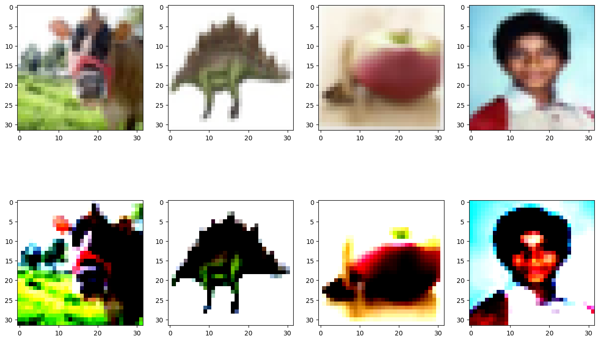

## RandomApply
### RandomApply는 주어진 transforms 들을 무작위로 적용하는 함수이다. 다른 transforms 함수들을 parameter 로 요구한다.
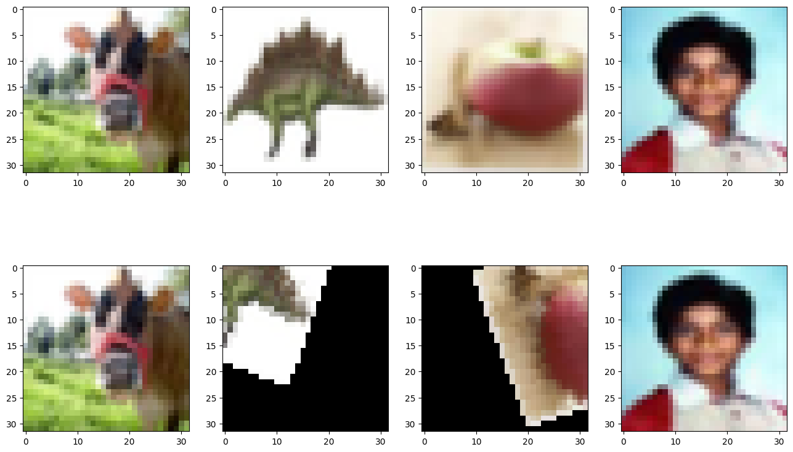

## RandomApply
### RandomApply는 주어진 transforms 들을 무작위로 적용하는 함수이다. 다른 transforms 함수들을 parameter 로 요구한다.
